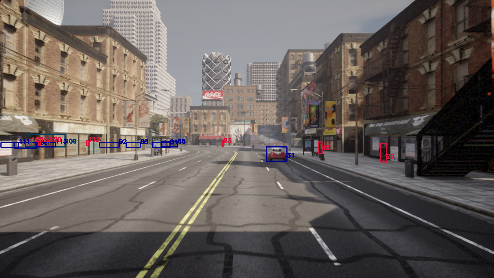
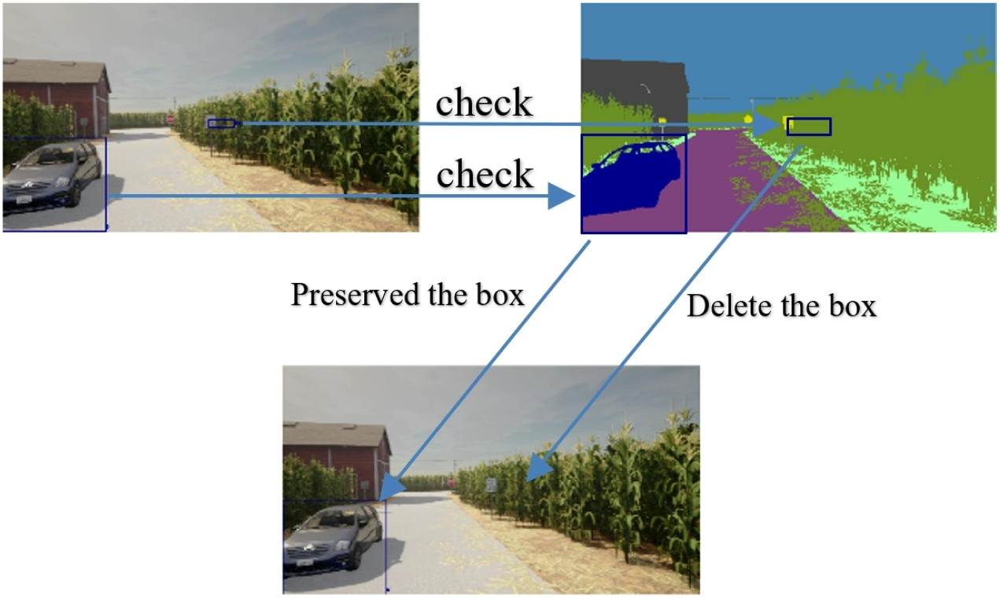
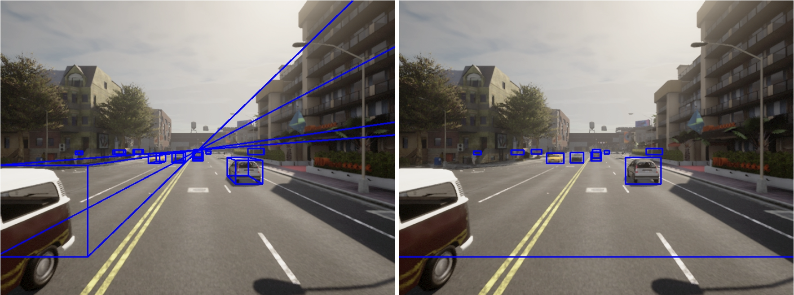

# Improving-bouning-box-in-Carla-simulator
This Project is connected to the Urban mobility at Aschffenburg University of Applied Science.</br>
This work divided to two main works </br>
**-Improving bounding box in Carla simulator**</br>
**-Improving Carla simulator tools to generate flexible environments using YAML files**.</br>
In this readme file, we will explain the first work (Improving bounding box in Carla simulator) the explanation of the second work is written as a readme file inside the folder `crlasimu`.</br> 
## Folder Constructions
📦root<br>
 ┣ 📂carlasimu --> contains the tools to generate datasets. <br>
 ┃ ┣ 📂 yaml_files --> Contains all yaml files to control on environments of carla simulator <br>
 ┃ ┃ ┣ boundingBox.yaml --> Contain all the parameters correlate to the bounding box <br> 
 ┃ ┃ ┣ color_segmentation.yaml --> RGB color of the objects see the [link](https://carla.readthedocs.io/en/latest/ref_sensors/#semantic-segmentation-camera)<br> 
 ┃ ┃ ┣ data.yaml --> Data of the carla envirnment<br> 
 ┃ ┃ ┣ mapLayer.yaml --> Boolean parameters to delete the buildings or parked vehicles<br> 
 ┃ ┃ ┣ sensors.yaml --> Sitting the sensor parameters<br> 
 ┃ ┃ ┣ vehicles_name.yaml --> Name of vehicles in Carla simulator see the [link](https://carla.readthedocs.io/en/latest/catalogue_vehicles/)<br> 
 ┃ ┃ ┗ weather.yaml --> Weather parameters see the [link](https://carla.readthedocs.io/en/latest/python_api/#carlaweatherparameters)<br> 
 ┃ ┃ <br>
 ┃ ┣ ActorController.py --> This file is for control of the actors **(do not change the code, all the controllers could be implemented by yaml files as we will see later).**<br>
 ┃ ┣ Actors.py --> Set the actors in the environment (do not change the code).<br>
 ┃ ┣ BoundingBox.py --> Calculate the bounding box of objects and filter the unwanted boxes. (do not change the code)<br> 
 ┃ ┣ Manager.py --> Manage the enviernmnt. (do not change the code)<br> 
 ┃ ┣ carlaUtils.py --> Tools for the code. (do not change the code)<br> 
 ┃ ┣ config.py --> Open yaml files. (do not change the code)<br> 
 ┃ ┣ exceptions.py --> Manage the exceptions. (do not change the code)<br> 
 ┃ ┣ sensors.py --> Install the sensros. (do not change the code)<br> 
 ┃ ┗ weather.py --> control on the weather conditions. (do not change the code)<br> 
 ┃<br>
 ┣ 3D_Bounding_Box.py --> Generate data with 3D bounding box annotation.<br>
 ┗ boundingBox.py --> Generate data with 2D bounding box annotation.<br>

## Filter Bounding Boxes
In the Carla simulator, the generating of datasets with bounding box annotation suffers a problem where it does not take into account the objects that are obscured by obstructions as in the Image below.<br>
<br>
         bounding box before the filter<br>
and we called these boxes `Gohst boxes`.<br>
Our work in the project concerns filtering the boxes where they should be deleted.
We have implemented a Semantic segmentation camera in Carla Simulator to filter the boxes by comparing the color of image segmentation and the object in which it is detected. See the colors of image segmentation on Carla simulator [here](https://carla.readthedocs.io/en/latest/ref_sensors/#semantic-segmentation-camera).<br>
**In the Image below** we could find out our methodology to filter the boxes using the image segmentation sensor.
<br>
         <strong>Figure 1:</strong> In this filter, we check each box in image segmentation
camera if it fulfills 10% of the color corresponding
to the object in image segmentation. In our example the
color of the car in image segmentation in Carla is (0, 0,
142), the small box behind the field is hidden and there is
no pixel with value (0, 0, 142) inside of it, as compared to
the bounding box for the car in the large box.<br>
<br><br>
### A significant portion of the bounding box
Our work also solved the problem of a significant portion of the bounding box when we labeled our images to 2D bounding box and also solved the beam effect of boxes for negative notation of bounding g boxes as in the image at below.<br>
<figure>
    <br>
    <figcaption><strong>Figure 2:</strong> The negative notation effects on the bounding
boxes for the objects. For a 3D bounding box, the box appears
as a beam (left). For the 2D bounding box (see the right
image), the box should have included the vehicle (in the
corner of the image at the right) inside, but instead, it is
covering a significant portion of the entire image.</figcaption>
</figure><br><br>
## Generate the Data
To create more flexible environments with various factors like a number of vehicles, pedestrians, and weather conditions, we developed our carlasimu package. You can control these environmental elements through parameters defined in **YAML files**. While not intended for data generation, carlasimu is also useful for running custom environments tailored to your specific needs.
Our project focuses on generating data from image sensors with annotations for 2D and 3D bounding boxes of six object categories: cars, buses, trucks, vans, pedestrians, and traffic lights. Additionally, the system can be extended to collect data from various sensor modalities, including Lidar, Radar, Depth Cameras, and semantic segmentation cameras.
### Yamal Files
The path of yaml files as the following `root/carlasimu/yaml_files`.<br>
### data.yaml ###
<table style="width:100%">
  <tr>
    <td><strong>Parameter</td>
    <td><strong>Value</td>
    <td><strong>Explains</td>
  </tr>
  <tr>
    <td>number_of_wheels</td>
    <td>str: '2','4','ALL', Default is '4'</td>
    <td>The Number of wheels in the vehicles, if you put '2' all the vehicles are motorcycles and bycicles</td>
  </tr>
  <tr>
    <td>generationv</td>
    <td> str: "1","2","All", Default is 'All'</td>
    <td>Restrict to certain vehicle generation</td>
  </tr>
  <tr>
    <td>generationw</td>
    <td> str: "1","2","All", Default is 'All'</td>
    <td>Restrict to certain walkers generation</td>
  </tr>
  <tr>
    <td>number_of_vehicles</td>
    <td>int: Default is 150</td>
    <td>Number of Vehicles in the envirnment</td>
  </tr>
  <tr>
    <td>number_of_walkers</td>
    <td>list: [stand-->int, walk-->int, run-->int], Default is 150</td>
    <td>[number of stand walkers, number of walk walkers, number of run walkers]</td>
  </tr>
  <tr>
    <td>car_lights_on</td>
    <td>boolean: Default is False</td>
    <td>Enable automatic car light management</td>
  </tr>
  <tr>
    <td>hero</td>
    <td>boolean: Default is True</td>
    <td>Set one of the vehicles as hero (ego)</td>
  </tr>
  <tr>
    <td>respawn</td>
    <td>boolean: Default is True</td>
    <td>Automatically respawn dormant vehicles (only in large maps)</td>
  </tr>
  <tr>
    <td>light_state</td>
    <td>list of boolean describes the following lights: [All, Position, LowBeam, HighBeam, Brake, RightBlinker, LeftBlinker, Reverse, Fog, Interior, Special1, Special2]</td>
    <td> light state of the vehicles, default is False, for each light state is True, will be turned on, if you change the value to True for the parameter 'ALL', all the lights will be turned on and omit the rest</td>
  </tr>
  <tr>
    <td>respawn</td>
    <td>boolean: Default is True</td>
    <td>Automatically respawn dormant vehicles (only in large maps)</td>
  </tr>
  <tr>
    <td>respawn</td>
    <td>boolean: Default is True</td>
    <td>Automatically respawn dormant vehicles (only in large maps)</td>
  </tr>
</table><br>

**The rest of the parameters depends on the Carla sitting**<br>
### sensors.yaml
This file provides comprehensive control over sensor parameters, allowing you to tailor data collection to your specific needs, for more details [click here](https://carla.readthedocs.io/en/latest/ref_sensors/)<br> 
### boundingBox.yaml
This file is essential for collecting datasets, if you want to generate a dataset with a variety of sensors, you have to set up the parameters of this file as the following.<br>
**- Cam_rgb**<br>
<table style="width:100%">
  <tr>
    <td><strong>Parameter</td>
    <td><strong>Value</td>
    <td><strong>Explains</td>
  </tr>
  <tr>
      <td>save_to_file</td>
      <td>boolean: Default is 'True'</td>
      <td>if False will not save any image data</td>
  </tr>
  <tr>
      <td>save_dir</td>
      <td>str: Default is 'out\cam'</td>
      <td>directory to save the files</td>
  </tr>
  <tr>
      <td>bbox_dir</td>
      <td>str: Default is 'out\bbox'</td>
      <td>bounding box directory</td>
  </tr>
  <tr>
      <td>path_save</td>
      <td>str: Default is 'box'</td>
      <td> the path to save the image data</td>
  </tr>
  <tr>
      <td>3D</td>
      <td>boolean: Default is 'False'</td>
      <td> if false the bounding box will be 2D</td>
  </tr>
  <tr>
      <td>figure_in_window</td>
      <td>boolean: Default is 'True'</td>
      <td>True means to show the vehicle during its driving in the window</td>
  </tr>
  <tr>
      <td>filter</td>
      <td>boolean: Default is 'True'</td>
      <td>filter blocked objects</td>
  </tr>
  <tr>
      <td>max_distance</td>
      <td>int: Default is 50 (the unit in meters)</td>
      <td>max distance to labeling the object in boxes</td>
  </tr>
  <tr>
      <td>min_distance</td>
      <td>int: Default is 1 (the unit in meters)</td>
      <td>min distance to labeling the object in boxes</td>
  </tr>
  <tr>
      <td>actors</td>
      <td>list of boolean: [vehicles, walkers] default is [True, True]</td>
      <td> if false the cam will ignore labeling vehicles or walkers in the bounding box </td>
  </tr>
  <tr>
      <td>num_image</td>
      <td>int: Default is 1000</td>
      <td>The number of images to save them, when it finish, the environment of Carla will be colose</td>
  </tr>
</table><br>
**- image_segmentation**<br>
<table style="width:100%">
  <tr>
    <td><strong>Parameter</td>
    <td><strong>Value</td>
    <td><strong>Explains</td>
  </tr>
  <tr>
      <td>save_to_file</td>
      <td>boolean: Default is 'True'</td>
      <td>if False will not save any image data</td>
  </tr>
  <tr>
      <td>save_dir</td>
      <td>str: Default is 'out\seg'</td>
      <td>directory to save the files</td>
  </tr>
      <td>figure_in_window</td>
      <td>boolean: Default is 'False'</td>
      <td>True means to show the vehicle during its driving in the window</td>
  </tr>
</table><br>
<strong>- radar_sensor</strong><br>
<table style="width:100%">
  <tr>
    <td><strong>Parameter</td>
    <td><strong>Value</td>
    <td><strong>Explains</td>
  </tr>
  <tr>
      <td>save_to_file</td>
      <td>boolean: Default is 'False'</td>
      <td>if False will not save any image data</td>
  </tr>
  <tr>
      <td>save_dir</td>
      <td>str: Default is 'out\radar'</td>
      <td>directory to save the files</td>
  </tr>
      <td>figure_in_window</td>
      <td>boolean: Default is 'False'</td>
      <td>True means to show the vehicle during its driving in the window</td>
  </tr>

</table><br>
<strong>- lidar_sensor</strong><br>
<table style="width:100%">
  <tr>
    <td><strong>Parameter</td>
    <td><strong>Value</td>
    <td><strong>Explains</td>
  </tr>
  <tr>
      <td>save_to_file</td>
      <td>boolean: Default is 'False'</td>
      <td> If False will not save any data for this sensor</td>
  </tr>
  <tr>
      <td>save_dir</td>
      <td>str: Default is 'out\lidar'</td>
      <td>directory to save the files</td>
  </tr>
      <td>figure_in_window</td>
      <td>boolean: Default is 'False'</td>
      <td>True means to show the vehicle during its driving in the window</td>
  </tr>

</table><br>
<strong>- depth_image_sensor</strong><br>
<table style="width:100%">
  <tr>
    <td><strong>Parameter</td>
    <td><strong>Value</td>
    <td><strong>Explains</td>
  </tr>
  <tr>
      <td>save_to_file</td>
      <td>boolean: Default is 'False'</td>
      <td> If False will not save any data for this sensor</td>
  </tr>
  <tr>
      <td>save_dir</td>
      <td>str: Default is 'out\depth'</td>
      <td>directory to save the files</td>
  </tr>
      <td>figure_in_window</td>
      <td>boolean: Default is 'False'</td>
      <td>True means to show the vehicle during its driving in the window</td>
  </tr>

</table><br>
<strong>- threshold_small_box</strong><br>
int: Default is 10: The default threshold for vehicle detection is set to 10%.<br>
This means that if at least 10% of the pixels within a designated box contain information about a vehicle, the system will consider it a valid detection and not filter it out.<br>
<strong>- size_big_box:</strong><br>
int: Default is 70: This value determines whether a box is considered "big." Boxes that occupy more than 70% of the entire image are filtered out in another threshold which is called  `threshold_big_box`, as they likely represent the entire scene rather than a specific object. **see the Figure 2**<br>
<strong>- threshold_big_box</strong><br>
int: Default is 50: The default threshold for vehicle detection is set to 50%.<br>
This means that if at least 50% of the pixels within a designated  **big box** contain information about a vehicle, the system will consider it a valid detection and not filter it out.<br>
<strong>- time_screen_shot</strong><br>
int: Default is 1: The default data saving interval is set to 1 second. This means that an image is captured and saved to the data set every second.<br>
### color_segmentation.yaml
The color according to image segmentation of the Carla sittings (do not change it).<br>
### mapLayer.yaml
**building** boolean: Default is 'True' if we sit it as a 'False' the buildings will disappear in the map of Carla<br>
**ParkedVehicles** boolean: Default is 'False' if we sit it as a 'True' the parked vehicles will appear in the map of Carla<br>
### vehicles_name.yaml
The name of vehicles in Carla simulator (do not change it)<br>
### weather.yaml
sitting the values of the weather parameters [see the link](https://carla.readthedocs.io/en/latest/python_api/#carlaweatherparameters).<br>
<details open>
<summary>Python API</summary>
  
```python
carlasimu.carlaUtils.CarlaEnvironments(host,port,maps,set_timeout)
```
</details>

## First Step
To implement your custom environment in your Carla simulator firstly you have to sit up your parameters in YAML files.<br>
Then look the Carla by double clicking on the file `CarlaUE4.exe` for Windows, for Linux implement the following command<br>
```bash
cd /carla/root
./CarlaUE4.sh
```
The root folder should be inside of `Python API` folder in the Carla simulator [see the link](https://carla.readthedocs.io/en/latest/tuto_first_steps/).<br>

# license
[license](LICENSE)<br>

